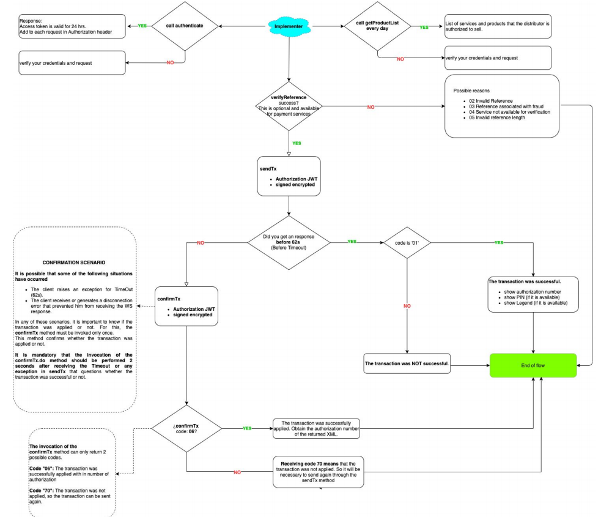

export const Highlight = ({children, color}) => ( <span style={{
      backgroundColor: color,
      borderRadius: '2px',
      color: '#fff',
      padding: '0.2rem',
    }}>{children}</span> );

Below is a brief summary of the indispensable methods of the Gestopago API. After this list, each one of them will be described in detail, including methods that do not participate directly in the sales flow.

## sendEcho
This method validates the Token send on the authorization header and if it’s correct returns the “codigoDispositivo” value of the commerce.  This method can be used to test and measure connectivity to Gestopago.

## validateMe
This method validates the Token send on the authorization header and if it’s correct returns the commerce Information.

## getProductList
This method obtains the list of services and products that the distributor is authorized to sell. It is a method that allows the integrator to save in their database the product/service ID's, which they will use in the sendTx method and confirmTx.


:::note
It is recommended that this method be executed only once per day at 12:05 am as updates on new products, new prices or new services are executed at 12.00am by Gestopago.
:::

The response of the method is a String that contains an XML with the following structure:

```
<RESPONSE>  
<MENSAJE>
<CODIGO>01</CODIGO> 
<TEXTO>OPERACION REALIZADA CON EXITO</TEXTO> 
</MENSAJE>
<PRODUCTOS>
<producto     servicio='NombreServicio' 
    producto='Telcel Recarga 100' 
    idServicio=’1’  
    idProducto='5'     
    idCatTipoServicio = '1' 
    tipoFront = '1' 
    hasDigitoVerificador = 'true'
    tipoReferencia = 'ab'
    precio='100' />
</PRODUCTOS>
</RESPONSE>
```

### Detail of XML returned fields

**servicio** (String)
It is the name of the service. An example of a service is Telcel, Movistar, water payment, natural gas payment, sky, Telmex etc ...

**producto** (String)
It is the name of the product. An example of a product is recharge 100, recharge 200, recharge 300 etc ...

**idServicio** ( Integer )
Id of the service

**idProducto** ( Integer )
It is the product identifier

**idCatTipoServicio** ( Integer )
Describe the type of service handled on the platform, which is as follows.

1. Movistar
1. Telcel
1. ATT/Iusacell
1. Unefon
1. Pago de Servicios
1. Nextel
1. Pago de Impuestos / Gobierno
1. Productos Financieros
1. Productos por Catálogo
1. Servicios de Prepago
1. Entretenimiento
1. Virgin
1. Otras Recargas
1. Venta de Seguros
1. Pago derechos de agua
1. Juegos y Sorteos
1. Servicios de Autopistas y Transportes

Telephone companies are a type of service, this helps many customers to be able to group their services and products in a better way.

### tipoFront ( Integer )
It is a numerical field that identifies the type of front end necessary to carry out the collection of parameters in the system. At the moment there are 4 different types of front, which are explained below:

**tipoFront = 1**  
(For Services where the only field requested is the Customer's Telephone number).

It is necessary to contemplate a text field for the collection of the customer's telephone, as well as the service and the product, the latter commonly represented in a list or selection field that the end-user selects.

**tipoFront = 2**  
(For Services where it is necessary to enter a Reference number).

This type of front is used to make the payment of a service:
1. Payment Amount (numerical field to obtain the amount to be paid to the indicated service).
1. Service reference (alphanumeric up to 50 characters).
1. User phone (reference for the platform).
1. Digit Verifier (only applies if the product indicates it in the XML obtained from the getListProduct in digit fieldVerifier).

**tipoFront = 4** 

(For Service Balance Check)

This type of service is used by the web service consumer to obtain the balance of a customer given a reference. No transaction is generated, so the service is considered informative.

The front is prepared for the following 2 conditions:
1. It is not necessary to send the field Monto
1. The RESPONSE XML will contain an additional field called: ``` <SALDOCLIENTE>``` which must be used to show the client or as an input of a subsequent process, eg:

```
<RESPONSE>
<ID_TX>-1</ID_TX>
<NUM_AUTORIZACION>1</NUM_AUTORIZACION>
<SALDO>574483.28</SALDO>
<COMISION>0.0</COMISION>
<SALDO_F>574,483.28</SALDO_F>
<COMISION_F>0</COMISION_F>
<FECHA>23/Ene/2016 19:49:42</FECHA>
<MONTO>0.0</MONTO>
       <MENSAJE>
             <CODIGO>01</CODIGO>
<SALDOCLIENTE>34.50</SALDOCLIENTE>
             <TEXTO/>
            <REFERENCIA/>
       </MENSAJE
</RESPONSE>

```
### tipoReferencia

The field tipoReferencia allows us to identify 2 aspects, the origin of the reference to enter and the parameter of the API where this value can be sent. The reference types are distinguished as follows:

- a. Telephone Number (sent in the "telefono" field).
- b.- Customer number/ Service / Contract / TAG number (sent in the "referencia" field).
- c.- Barcode (sent in the "referencia" field).
- ab.-You can use the two types of reference "a" or "b" interchangeably.
- bc.-You can use the two types of reference "b" or "c" interchangeably.

Each product listed will come with one of the following values:

- tipoReferencia="a"
- tipoReferencia="ab"
- tipoReferencia="c"
- tipoReferencia="bc" 

**hasDigitoverificador (boolean)**
Field that indicates if the service-product needs a check digit field for the moment of use.

**Precio ( Double )**
Field that indicates the price to the final customer of the product-service. In the case of payment of services, this field indicates the cost or commission to be charged to the final customer for the use of the service.

### Types of service( idCatTipoServicio  )
The type of service to which each service / product belongs corresponds to the XML list of the product list, according to the following table: 

| id            |    tipoServicio                             |
| ------------- | :---------------------------------------:   |
|       1       |  B) Movistar                                |
|       2       |  A) Telcel                                  |
|       3       |     AT&T                                    |
|       4       |  D) Unefon                                  |
|       5       |  H) Pago de Servicios                       |
|       6       |  E) Nextel                                  |
|       7       |  J) Pago de Impuestos / Gobierno            |
|       8       |  N) Productos Financieros                   |
|       9       |  P) Productos por Catálogo                  |
|       10      |  K) Servicios de Prepago                    |
|       11      |  L) Entretenimiento                         |
|       12      |  F) Virgin                                  |
|       13      |  G) Otras Recargas                          |
|       14      |  O) Venta de Seguros                        |
|       15      |  I) Pago de Derechos de Agua                |
|       16      |  Q) Juegos y Sorteos                        |
|       17      |     MazTiempo                               |
|       18      |  M) Servicios de Autopistas y Transportes   |

### Prepaid and entertainment services
They are the <Highlight color="#25c2a0"> **idCatTipoServicio 10 and 11** </Highlight> of the previous table and are those products that when purchased the customer must receive in some way a PIN or FOLIO to redeem for the purchased product. Examples of this type of product are: Cinépolis, Playstation, Nintendo, Spotify, Blim and Inbursa Aquarium etc ... The pins or folios are accompanied by specific instructions for products to be redeemed, commonly accessing the provider's website.

Delivery of PIN to the client through the integrator's own methods
Delivery of the folio / PIN should be provided  to the final user. Following this flow the integrator will receive in the response of the sendTx.do method the nodes ```<PIN>``` and ```<LEYENDA>``` in the XML. The Leyenda field will contain the specific product instructions to redeem it.


In order for the platform to deliver the PIN in the response of the sendTx method, it is necessary to send it in the field telefono <Highlight color="#25c2a0">1111111111</Highlight> (ten ones) so that the platform knows that it must go through the mentioned flow.

## sendTx
This method is used to make a sale of any type of product/service. To use this method it is necessary to know the tipoFront of the product so that the integrator knows what are the parameters that the API will be waiting for that product. At the moment 4 different types of front are identified, which are explained in greater detail below.
The sendTx method could return success or failure in his invocation, in the case of failure is requested to map the error codes for the correct interpretation. The current error table is detailed below.

## confirmTx
When the sendTx.do method does not return any result (failure or success) either for a timeout or for some type of disconnection that makes it impossible for the implementer to receive the sale response, ** _it is obligatory to execute the confirmTx method with exactly the same parameters previously used in sendTx.do_**.

This method has the goal of recovering the final status of the transaction by returning if it was successful or not. The most important consideration for the execution of this method is that <Highlight color="#25c2a0"> **it should not be executed before 62 seconds** </Highlight> of having sent the sendTx, since if it was sent before this time it could return that the operation was not completed when the natural lifetime of the operation is 62 seconds.

## getBalance
This method allows the integrator to know the balance of his prepaid bag, so he can have his own platform updated with the remaining balance.

## verifyReference
This method allows verifying if the reference sent for a Service Payment is valid, allowing the integrator to reduce the number of possible reversals by validating a reference before sending it to pay.

**NOTES:** 
Not all service payments are available for verification. If a service is not available for validation, the integrator must simply continue with the subscription process.
Some services show the reference balance, so the response can be successful with the balance or successful without the balance.

## Duplicate TRANSACTIONS

### For airtime sales
A duplicate transaction is considered when the system finds that the same recharge was sold to the same destination in the last 15 minutes, so it will be necessary to wait this time to repeat the recharge.


### For payment of services
The threshold to consider it duplicated is one day for the same payment reference.

When a transaction is  <Highlight color="#25c2a0"> **_considered duplicated_** </Highlight> , the system will not apply it.


## API FLOW  GESTOPAGO


